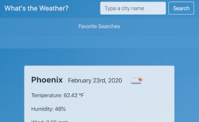

# Check Weather Application

## Description

An easy to use weather application that allows you to search for a city and view the current weather, as well as the five-day forcast. Previously viewed cities are added to the favorites list for quick future reference.

## [Try it yourself!](https://bfeliz.github.io/check-weather-app/)

The following image shows a glimpse of the application:

## Getting Started

This is a simple application that runs right in the browser, no installation or downloads needed.

## Built With:

JavaScript - programming language  
Bootstrap - CSS Framework  
OpenWeatherMap - API for weather data

## Author:

Brittany Fortner  
Refactor assistance from: Tucker Beauchamp  
See commit history [here](https://github.com/bfeliz/check-weather-app/graphs/contributors).

## Planned Updates

There are no plans to further update this application at this time.
