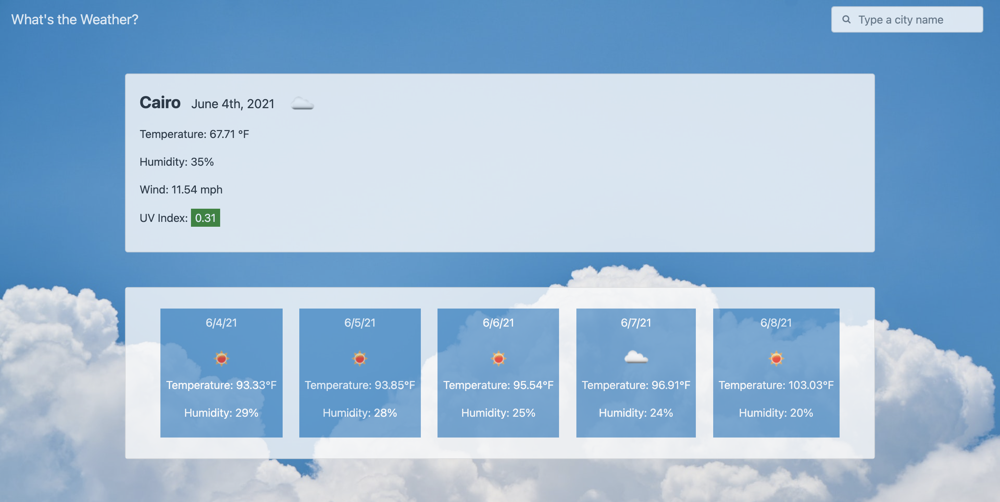
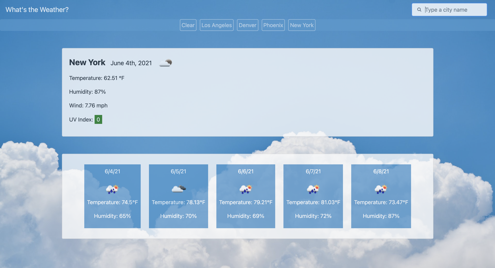

# Check Weather Application

## Description

A minimalistic weather application that allows you to search for a city and view the current weather and the upcoming five-day forecast. Previously viewed cities are added to the favorites list for quick future reference.

## [Try it yourself!](https://bfeliz.github.io/check-weather-app/)

The following images show a glimpse of the application:

## Getting Started

This is a simple application that runs right in the browser, no installation or downloads needed.

## Built With:

HTML  
JavaScript/jQuery  
Bootstrap  
OpenWeatherMap API

## Author:

Brittany Crosthwait

## Planned Updates

There are no plans to further update this application at this time.
